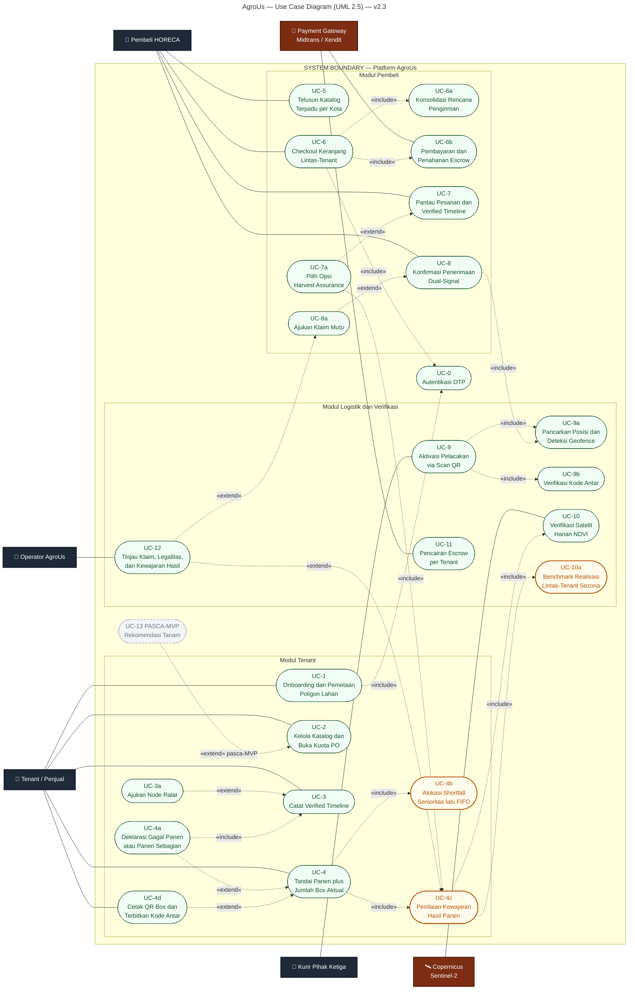

# AgroUs — Use Case Diagram (UML 2.5) — v2.3

> Aktor primer: Tenant/Penjual, Pembeli HORECA, Kurir Pihak Ketiga.
> Aktor sekunder & sistem eksternal: Operator AgroUs, Payment Gateway (Midtrans/Xendit), Copernicus Sentinel-2.
>
> **v2.1:** tambah **UC-9b Verifikasi Kode Antar** — `«include»` dari UC-9, sebelum UC-9a.
>
> **v2.2:** tambah **UC-4a Deklarasi Gagal/Panen Sebagian** dan **UC-4b Alokasi Shortfall**.
>
> **v2.3:**
> 1. **UC-4c Penilaian Kewajaran Hasil** — `«include»` dari UC-4 (FR-4.10). Inilah yang menutup celah
>    "satelit tidak bisa menghitung box" dan menggantikan ambang tetap 15%.
> 2. **UC-4b diperluas** menjadi *Senioritas + FIFO* (FR-7.13), bukan FIFO murni.
> 3. **UC-12 diperluas** mencakup tinjauan hasil `PERLU_DITINJAU` (FR-7.12a).
> 4. **UC-13 Rekomendasi Tanam** ditampilkan sebagai **[PASCA-MVP]** — didokumentasikan, tidak dibangun.
>
> **Catatan render:** label garis diringkas demi kerapian layout — kondisi lengkap tiap relasi ada di
> tabel **"Kondisi Relasi"** di bawah diagram.

## Kondisi Relasi

| Relasi | Jenis | Kondisi / Keterangan | Ref |
|---|---|---|---|
| UC-1 → UC-0 | «include» | Onboarding selalu melalui autentikasi OTP | FR-1.3 |
| UC-6 → UC-0 | «include» | Checkout mensyaratkan login OTP | FR-1.3 |
| UC-6 → UC-6a | «include» | Checkout selalu mengonsolidasi rencana pengiriman | FR-2.4 |
| UC-6 → UC-6b | «include» | Checkout selalu berakhir di pembayaran + penahanan escrow | FR-2.8, FR-7.1 |
| UC-9 → UC-9b | «include» | Kode Antar diverifikasi **sebelum** sesi pelacakan aktif | FR-6.2 |
| UC-9 → UC-9a | «include» | Sesi aktif memancarkan posisi + deteksi geofence | §5.6.2 |
| UC-8 → UC-9a | «include» | **Sinyal-1** dual-signal PoD: geofence memicu notifikasi konfirmasi | §5.6.4 |
| UC-3a → UC-3 | «extend» | Hanya bila Tenant perlu mengoreksi node (node asli tetap tampil) | FR-4.2 |
| **UC-4 → UC-4c** | «include» | **Baru v2.3.** Menandai Panen **selalu** memicu penilaian kewajaran hasil terhadap pita NDVI | FR-4.10 |
| UC-4 → UC-4b | «include» | Menandai Panen selalu menjalankan alokasi ke PO terjual | FR-7.9 |
| **UC-4c → UC-10** | «include» | **Baru v2.3.** Pita kewajaran memerlukan puncak NDVI dari pipeline satelit | §6.2 poin 6 |
| **UC-4c → UC-10a** | «include» | **Baru v2.3.** Penilaian juga membandingkan terhadap benchmark realisasi zona | FR-7.12b |
| UC-4a → UC-4 | «extend» | Hanya bila hasil panen **kurang dari kuota terjual** | FR-7.8 |
| UC-4a → UC-3 | «include» | Deklarasi dicatat sebagai **node timeline `GAGAL_PANEN`** | FR-4.9 |
| UC-4d → UC-4 | «extend» | Hanya setelah status batch = Panen; QR + Kode Antar terbit bersamaan | FR-3.6, FR-6.1 |
| UC-7a → UC-7 | «extend» | Hanya bila **gagal panen atau shortfall** | FR-7.4 |
| **UC-7a → UC-4c** | «include» | **Baru v2.3.** Opsi substitusi yang ditampilkan **bergantung** pada hasil penilaian kewajaran: `TIDAK_WAJAR` menggugurkan cap 10% | FR-7.11 |
| UC-8a → UC-8 | «extend» | Hanya bila ada keberatan mutu dalam jendela klaim | FR-5.3 |
| UC-12 → UC-8a | «extend» | Hanya bila nilai klaim **> 10% nilai order** | FR-5.6 |
| **UC-12 → UC-4c** | «extend» | **Baru v2.3.** Hanya bila penilaian menghasilkan `PERLU_DITINJAU` | FR-7.12a |
| UC-13 → UC-2 | «extend» | **[PASCA-MVP]** Membuka kuota dari rekomendasi. Tidak dibangun di MVP — data dikumpulkan (FR-8.1), antarmuka ditunda | §5.8 |

## Poin Penting

**1. UC-4c adalah jawaban atas satu-satunya lubang moat yang diakui PRD.** Risiko 1b menyatakan satelit tidak dapat menghitung box. UC-4c tidak berpura-pura bisa — ia menilai **kewajaran**, dan itu terlihat dari relasinya: `«include»` ke UC-10 (NDVI individual) **dan** UC-10a (benchmark zona). Dua sumber, bukan satu.

**2. UC-4c di-`include`, bukan di-`extend`.** Penilaian kewajaran berjalan pada **setiap** deklarasi panen, bukan hanya saat mencurigakan. Kalau di-`extend`, artinya sistem baru memeriksa ketika sudah curiga — dan sistem tidak punya cara curiga tanpa memeriksa lebih dulu.

**3. Kurir tetap tidak memiliki garis ke UC-0.** Ini representasi formal dari zero-install: kurir menyentuh sistem tanpa pernah menjadi entitas di dalamnya. Satu-satunya gerbangnya adalah UC-9b.

**4. UC-13 sengaja digambar meski tidak dibangun.** Menghapusnya akan memutus ketertelusuran ke FR-8.2/8.3; menggambarnya penuh akan menyesatkan juri. Gaya abu-abu putus-putus menyatakan keduanya: ada di peta, tidak ada di MVP.

**5. UC-11 kini eksplisit "per Tenant".** Satu order lintas-Tenant menghasilkan beberapa pencairan terpisah — sebelumnya tersirat di ERD tetapi tidak terlihat di Use Case.
