# AgroUs — Activity Diagram: Siklus Hidup Pesanan (UML 2.5) — v2.3

> Empat fase: (1) Transaksi & Escrow, (2) Budidaya & Verifikasi Satelit (paralel),
> (3) Logistik Zero-Install, (4) Dual-Signal PoD & Penyelesaian.
>
> **v2.1:** Fase 3 menyisipkan input **Kode Antar** (`EK1`/`DK`); token ditandai terpakai **setelah kode benar**.
>
> **v2.2:** `D8` tidak lagi biner — Tandai Panen + jumlah aktual → alokasi FIFO → pratinjau → tiga cabang.
>
> **v2.3 — tiga perubahan pada blok panen:**
> 1. **Pita Kewajaran (`PLB`→`PLC`)** disisipkan **sebelum** alokasi. Hasil panen dinilai
>    `WAJAR` / `PERLU_DITINJAU` / `TIDAK_WAJAR` / `TIDAK_DAPAT_DINILAI` (FR-4.10).
> 2. **Alokasi (`ALC`)** kini **senioritas shortfall lebih dulu, baru FIFO `paid_at`** (FR-7.13).
> 3. **Penalti (`PEN`)** tidak lagi memakai ambang tetap 15%. Percabangan berbasis
>    ketersediaan dasar penilaian → pita individual → benchmark zona (FR-7.12a–e).
>    Jalur `TIDAK_DAPAT_DINILAI` **tidak menjatuhkan penalti** — menghukum tanpa dasar lebih merusak
>    daripada melewatkan satu pelanggaran.

```mermaid
---
title: "AgroUs — Activity Diagram: Siklus Hidup Pesanan (UML 2.5) — v2.3"
---
flowchart TB
    START(("●")) --> A1

    subgraph F1["FASE 1 — TRANSAKSI DAN ESCROW"]
        A1["Pembeli: susun keranjang lintas-Tenant<br/>dan rencana pengiriman terkonsolidasi"]
        A1 --> D1{"Nilai order memenuhi<br/>minimum zona?"}
        D1 -- "Tidak" --> A2["Sistem: blokir checkout,<br/>sarankan tambah item"] --> A1
        D1 -- "Ya" --> A3["Sistem: reservasi kuota batch"]
        A3 --> D2{"Kuota batch tersedia?"}
        D2 -- "Ya" --> A4["Sistem: buat tagihan via Payment Gateway<br/>QRIS / VA / E-Wallet"]
        A4 --> D3{"Pembayaran tervalidasi<br/>sebelum kedaluwarsa?"}
        D3 -- "Tidak atau timeout" --> A5["Sistem: lepas reservasi kuota"]
        D3 -- "Ya" --> A6["Sistem: tahan dana di escrow mitra<br/>catat paid_at sebagai kunci urutan<br/>status = Menunggu Panen"]
    end

    D2 -- "Tidak" --> FAIL1
    A5 --> FAIL1

    A6 --> FORK["«fork» — dua proses berjalan paralel"]

    subgraph F2["FASE 2 — BUDIDAYA DAN VERIFIKASI SATELIT (PARALEL)"]
        FORK --> B1["Tenant: input node timeline<br/>jenis + deskripsi + foto kamera + GPS"]
        B1 --> D4{"Elemen wajib lengkap<br/>dan GPS dalam poligon?"}
        D4 -- "Tidak" --> B2["Sistem: tolak simpan, atau wajib<br/>alasan tertulis yang tampil ke Pembeli"] --> B1
        D4 -- "Ya" --> B3["Sistem: simpan node append-only<br/>dengan rantai hash SHA-256"]
        B3 --> D5{"Node = Panen?"}
        D5 -- "Belum" --> B1

        FORK --> C1["Sistem: job harian tarik scene<br/>Sentinel-2 untuk poligon aktif"]
        C1 --> D6{"Tutupan awan maksimal 40%?"}
        D6 -- "Tidak" --> C2["Badge = Tidak Dapat Diverifikasi<br/>bukti foto menjadi lapis kedua"]
        D6 -- "Ya" --> C3["Hitung deret NDVI/NDMI<br/>simpan puncak NDVI untuk pita kewajaran"]
        C3 --> D7{"Selisih tanggal<br/>klaim vs deteksi?"}
        D7 -- "kurang dari 7 hari" --> C4["Badge = Terverifikasi Satelit"]
        D7 -- "7 sampai 21 hari" --> C5["Badge = Perlu Ditinjau<br/>selisih tampil terbuka"]
        D7 -- "lebih dari 21 hari" --> C6["Badge = Tidak Sesuai<br/>selisih tampil terbuka"]
    end

    D5 -- "Ya" --> JOIN
    C2 --> JOIN
    C4 --> JOIN
    C5 --> JOIN
    C6 --> JOIN
    JOIN["«join» — sinkronisasi"]

    subgraph F2B["FASE 2B — PENILAIAN KEWAJARAN HASIL (BARU v2.3)"]
        JOIN --> HV["Tenant: Tandai Panen<br/>+ WAJIB isi jumlah box AKTUAL"]
        HV --> PLB{"Puncak NDVI tersedia<br/>untuk hitung pita?"}
        PLB -- "Tidak, awan berkepanjangan" --> PL0["Nilai = TIDAK_DAPAT_DINILAI<br/>lanjut tanpa penalti"]
        PLB -- "Ya" --> PLC{"Laporan vs pita kewajaran<br/>luas x rendemen x faktor vigor"}
        PLC -- "Dalam pita" --> PLW["Nilai = WAJAR"]
        PLC -- "Marginal" --> PLT["Nilai = PERLU_DITINJAU<br/>antrean Operator SLA 1 hari"]
        PLC -- "Jauh di bawah pita<br/>padahal vegetasi normal" --> PLX["Nilai = TIDAK_WAJAR<br/>cap 10% akan gugur"]
    end

    PL0 --> ALC
    PLW --> ALC
    PLT --> ALC
    PLX --> ALC

    ALC["Sistem: alokasi hasil ke PO terjual<br/>1. senioritas shortfall siklus lalu<br/>2. lalu FIFO PAYMENTS.paid_at<br/>pesanan dipenuhi UTUH berurutan"]
    ALC --> PRV["Pratinjau dampak ke Tenant<br/>sebelum konfirmasi"]
    PRV --> D8{"Hasil panen<br/>vs kuota terjual?"}

    D8 -- "Penuh" --> E1["Tenant: cetak QR unik per box<br/>+ terbitkan Kode Antar 4 digit"]

    D8 -- "Sebagian" --> SP1["Pesanan terpenuhi utuh<br/>lanjut ke pengiriman"] --> E1
    D8 -- "Sebagian" --> SP2{"Pembeli di perbatasan:<br/>terima sebagian?"}
    SP2 -- "Ya, terima sebagian" --> SP3["Kirim porsi tersedia + refund sisa<br/>catat senioritas siklus berikutnya"] --> E1
    SP2 -- "Tidak, tolak semua" --> H1
    D8 -- "Gagal total<br/>node GAGAL_PANEN" --> H1

    subgraph F2C["FASE 2C — HARVEST ASSURANCE"]
        H1["Harvest Assurance:<br/>catat senioritas pembeli terdampak"]
        H1 --> DPL{"Nilai kewajaran<br/>hasil panen?"}
        DPL -- "TIDAK_WAJAR atau<br/>tidak terverifikasi" --> DCAP["Cap 10% GUGUR<br/>Tenant tanggung selisih PENUH"] --> D9
        DPL -- "WAJAR / PERLU_DITINJAU /<br/>TIDAK_DAPAT_DINILAI" --> DSUB{"Selisih harga substitusi<br/>maksimal 10% nilai PO?"}
        DSUB -- "Ya" --> D9{"Opsi Pembeli"}
        DSUB -- "Tidak" --> D9B{"Opsi Pembeli<br/>TANPA substitusi"}
        D9 -- "Substitusi Tenant lain,<br/>harga terkunci" --> E1
        D9 -- "Jadwal ulang" --> FORK
        D9 -- "Refund" --> R1["Sistem: kembalikan escrow<br/>via Payment Gateway"] --> REF
        D9B -- "Jadwal ulang" --> FORK
        D9B -- "Refund" --> R1
    end

    subgraph F2D["FASE 2D — PENALTI KUOTA BERBASIS BENCHMARK (BARU v2.3)"]
        ALC --> PEN{"Dasar penilaian<br/>yang tersedia?"}
        PEN -- "Tidak ada:<br/>awan + zona sepi" --> PN0["TIDAK_DAPAT_DINILAI<br/>TIDAK ada penalti"]
        PEN -- "Hanya pita individual<br/>kurang dari 5 batch pembanding" --> PNA{"Nilai = TIDAK_WAJAR?"}
        PEN -- "Pita + benchmark zona<br/>minimal 5 batch pembanding" --> PNB{"Deviasi signifikan terhadap<br/>rata-rata zona, berulang?"}
        PNA -- "Ya" --> PN1
        PNA -- "Tidak" --> PN0
        PNB -- "Ya" --> PN1["quota_multiplier 0.70 menjadi 0.50<br/>disertai penjelasan perhitungan<br/>pulih setelah 2 siklus wajar"]
        PNB -- "Tidak, musim buruk merata" --> PN0
    end

    subgraph F3["FASE 3 — LOGISTIK ZERO-INSTALL"]
        E2["Kurir: scan QR dengan kamera bawaan"]
        E2 --> D10{"Token sesi valid<br/>dan belum terpakai?"}
        D10 -- "Tidak" --> E3["Tolak akses: QR tidak berlaku,<br/>hubungi Tenant"] --> E2
        D10 -- "Ya" --> EK1["Kurir: masukkan Kode Antar<br/>4 digit dari Tenant"]
        EK1 --> DK{"Kode Antar benar?"}
        DK -- "Salah, maks 5x" --> EK1
        DK -- "Terkunci setelah 5x" --> EKX["Token terkunci<br/>Tenant terbitkan kode baru"] --> EK1
        DK -- "Ya" --> E4["Token ditandai terpakai<br/>status = Dikirim + Notif-1"]
        E4 --> D11{"Izin lokasi browser<br/>diberikan?"}
        D11 -- "Tidak" --> E5["Mode tanpa live-tracking:<br/>jalur konfirmasi manual tetap ada"]
        D11 -- "Ya" --> E6["Loop kirim posisi tiap 10 detik<br/>+ cek kewajaran anti-spoof"]
        E6 --> D12{"Sinyal terputus?"}
        D12 -- "Ya" --> E7["Tampilkan posisi terakhir<br/>dengan stempel waktu jujur"] --> E6
        D12 -- "Tidak" --> D12B{"Jarak sekitar 1 km?"}
        D12B -- "Ya" --> E7B["Notif-2: siapkan penerimaan<br/>jendela 60 menit BELUM mulai"] --> E6
        D12B -- "Belum" --> D13{"Jarak maksimal 100 m<br/>dari titik tujuan?"}
        D13 -- "Belum" --> E6
        D13 -- "Ya" --> E8["Status = Tiba di Lokasi<br/>Notif-3 WhatsApp + SMS fallback"]
    end

    E1 --> E2
    E5 --> E8

    subgraph F4["FASE 4 — DUAL-SIGNAL POD DAN PENYELESAIAN"]
        E8 --> D14{"Pembeli konfirmasi<br/>dalam 60 menit sejak Notif-3?"}
        D14 -- "Ya" --> G1["Konfirmasi 1-ketuk + foto kondisi<br/>status = Diterima, jendela klaim 2 jam"]
        D14 -- "Tidak, timeout" --> G2["Status = Diterima Otomatis<br/>jendela klaim diperpanjang 24 jam"]
        G1 --> D15{"Klaim diajukan<br/>dalam jendela?"}
        G2 --> D15
        D15 -- "Tidak" --> G3["Status = Selesai"]
        D15 -- "Ya" --> G4["Pembeli: ajukan klaim<br/>foto + berat hasil timbang"]
        G4 --> D16{"Selisih melebihi<br/>toleransi susut 3%?"}
        D16 -- "Tidak" --> G5["Klaim ditolak otomatis<br/>masih dalam toleransi"] --> G3
        D16 -- "Ya" --> D17{"Nilai klaim maksimal<br/>10% nilai order?"}
        D17 -- "Ya" --> G6["Potong escrow otomatis"] --> G3
        D17 -- "Tidak" --> G7["Antrean tinjauan Operator<br/>SLA 1 hari kerja"] --> G8["Penyesuaian escrow<br/>sesuai putusan"] --> G3
        G3 --> G9["Sistem: cairkan escrow<br/>PER TENANT via Payment Gateway"]
    end

    G9 --> SUCC((("Selesai<br/>Escrow Cair per Tenant")))
    FAIL1((("Pesanan Gagal<br/>Dana Tidak Ditarik")))
    REF((("Refund Penuh<br/>ke Pembeli")))

    classDef startEnd fill:#1F2937,color:#ffffff,stroke:#111827;
    classDef fail fill:#FEF2F2,color:#B91C1C,stroke:#B91C1C;
    classDef ok fill:#F0FDF4,color:#14532D,stroke:#14532D,stroke-width:2px;
    classDef bar fill:#1F2937,color:#ffffff,stroke:#111827;
    classDef baru fill:#FFFBEB,color:#B45309,stroke:#B45309,stroke-width:2px;
    class START startEnd;
    class FAIL1,REF fail;
    class SUCC ok;
    class FORK,JOIN bar;
    class PN1,PLX,DCAP fail;
    class PLW,PL0,PN0 ok;
    class HV,ALC,PLT baru;
```

## Poin Penting

**1. Penilaian kewajaran berada SEBELUM alokasi, bukan sesudah.** `PLB`/`PLC` berjalan begitu Tenant menekan Tandai Panen, sehingga hasilnya sudah tersedia saat `DPL` memutuskan apakah cap 10% berlaku. Kalau ditaruh sesudah, Harvest Assurance akan menawarkan opsi substitusi berdasarkan informasi yang belum ada.

**2. Ada empat jalur keluar dari `PLC`, dan salah satunya sengaja tidak menghukum.** `PL0` (`TIDAK_DAPAT_DINILAI`) melanjutkan alur tanpa penalti. Ini konsekuensi langsung FR-7.12e — sistem yang menghukum saat langit mendung akan kehilangan Tenant lebih cepat daripada kehilangan uang karena satu shortfall palsu.

**3. `PEN` tidak lagi punya angka.** Bandingkan dengan v2.2 yang bertuliskan *"Shortfall lebih 15%"* di node keputusan. Sekarang percabangannya adalah **ketersediaan dasar penilaian**, bukan besaran. Diagram ini bisa ditayangkan ke publik tanpa membocorkan ambang — itu bagian dari desainnya (FR-7.12c).

**4. Cabang `PNB` "musim buruk merata" adalah inti keadilan mekanisme ini.** Ketika seluruh zona gagal, benchmark ikut turun, deviasi mengecil, dan tidak ada yang dihukum. Ambang tetap tidak bisa membedakan ini.

**5. Senioritas tercatat di dua tempat.** `SP3` (pembeli terima sebagian) dan `H1` (pembeli tolak/gagal total) sama-sama mencatat senioritas — karena keduanya sama-sama dirugikan. Kalau hanya salah satu yang dicatat, FR-7.13 bocor separuh.

**6. Fase 3 kini menampilkan notifikasi bertahap secara eksplisit** (`E7B` pada ±1 km), dan jendela 60 menit di `D14` dinyatakan dihitung **sejak Notif-3**, bukan sejak tiba. Ini menutup celah yang di v2.2 hanya ada di teks PRD.

**7. Tiga kondisi akhir dipertahankan.** Tidak ada jalur yang menggantung: setiap cabang berujung di Selesai, Gagal, Refund, atau kembali ke `FORK` (jadwal ulang).
