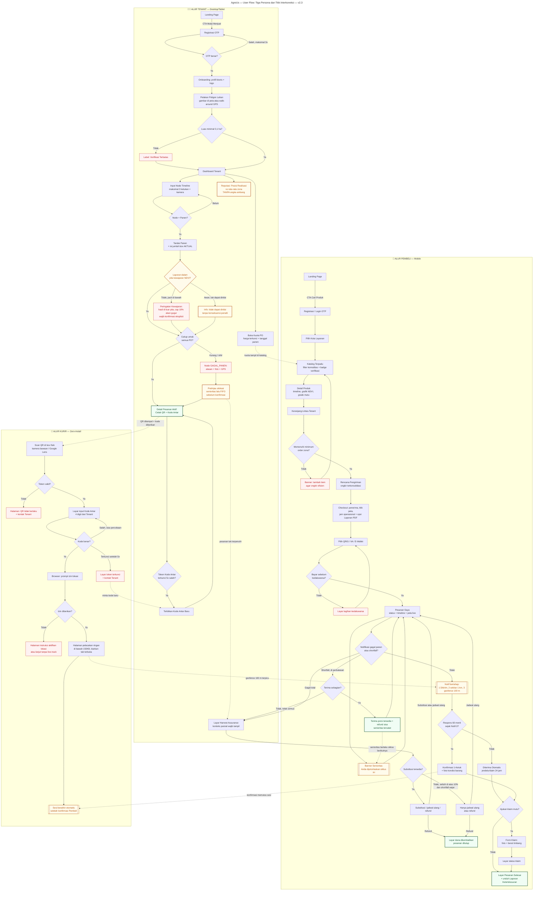

# AgroUs — User Flow: Tiga Persona dan Titik Interkoneksi — v2.3

> Alur Tenant (Desktop/Tablet), Pembeli (Mobile), dan Kurir (Zero-Install),
> beserta titik interkoneksi antar persona (garis putus-putus).
>
> **v2.1:** alur Kurir menyisipkan layar **input Kode Antar** (`KP`/`KPD`, kunci setelah 5x salah → `KPE`).
>
> **v2.2:** Tenant mendapat `TH1` Tandai Panen + jumlah aktual → `TH3` node GAGAL_PANEN → `TH4` pratinjau.
> Pembeli mendapat `PSB` pilihan terima sebagian dan `PSU` penyaringan opsi substitusi.
>
> **v2.3 — empat perubahan UX:**
> 1. **`THK` Peringatan Kewajaran** — muncul bila laporan hasil di luar pita NDVI, **sebelum** konfirmasi.
>    Tenant melihat konsekuensinya (cap 10% gugur) sebelum menekan, bukan sesudah.
> 2. **`TRP` Posisi Realisasi vs Zona** — menggantikan tampilan rasio shortfall bergaya "jarak menuju ambang".
>    Tidak menampilkan angka ambang (FR-7.12c).
> 3. **`PSN` Banner Senioritas** — pembeli yang dirugikan siklus lalu diberi tahu bahwa ia diprioritaskan (FR-7.13).
> 4. **Rekomendasi Tanam dihapus dari alur MVP** — modul ditunda ke pasca-MVP (§5.8).

## Poin Penting

**1. `THW` adalah layar paling penting yang ditambahkan v2.3.** Tenant melihat *"hasil di luar pita, cap 10% akan gugur"* **sebelum** menekan konfirmasi, bukan menerima notifikasi penalti seminggu kemudian. Ini bukan sekadar UX yang sopan — sistem yang menghukum tanpa peringatan akan kehilangan sisi pasok, dan sisi pasok adalah bagian yang paling sulit diakuisisi.

**2. `THN` sengaja dibuat berbeda dari `THW`.** Keduanya sama-sama "tidak dalam pita", tetapi penyebabnya berbeda: `THW` karena laporannya janggal, `THN` karena langitnya mendung. Menggabungkan keduanya akan membuat Tenant merasa dituduh karena cuaca.

**3. `TRP` menampilkan posisi relatif, bukan jarak menuju hukuman.** Perbandingan langsung dengan v2.2: dulu halaman ini menampilkan rasio shortfall dan peringatan mendekati ambang 15%. Sekarang: *"realisasi Anda di bawah rata-rata zona untuk komoditas ini"*. Angka ambangnya tidak ada di layar mana pun (FR-7.12c).

**4. `PSN` membuat FR-7.13 terlihat oleh penerimanya.** Senioritas yang tidak diberitahukan tidak menghasilkan retensi — pembeli tetap merasa dirugikan dan tetap churn. Banner ini adalah setengah nilai dari mekanismenya.

**5. Interkoneksi `KPE → TQ2` menutup lingkaran yang menggantung di v2.2.** Dulu layar "token terkunci" hanya menyuruh kurir menghubungi Tenant, tanpa jalur balik di sisi Tenant. Sekarang jelas: kurir terkunci → Tenant terbitkan kode baru → kurir masuk lagi.

**6. Rekomendasi Tanam hilang dari alur Tenant.** Bukan karena terlupa — modulnya ditunda (§5.8). Menggambarnya sebagai layar aktif akan membuat desainer mengerjakan halaman yang tidak dibangun.

**7. Setiap cabang error punya layar tujuan.** Tidak ada `-- Tidak -->` yang berujung buntu: `P8`, `P13`, `K3`, `K6`, `KPE`, `T7`, `TH3`, `THW` semuanya adalah state nyata yang harus didesain, bukan sekadar penanda logika.
