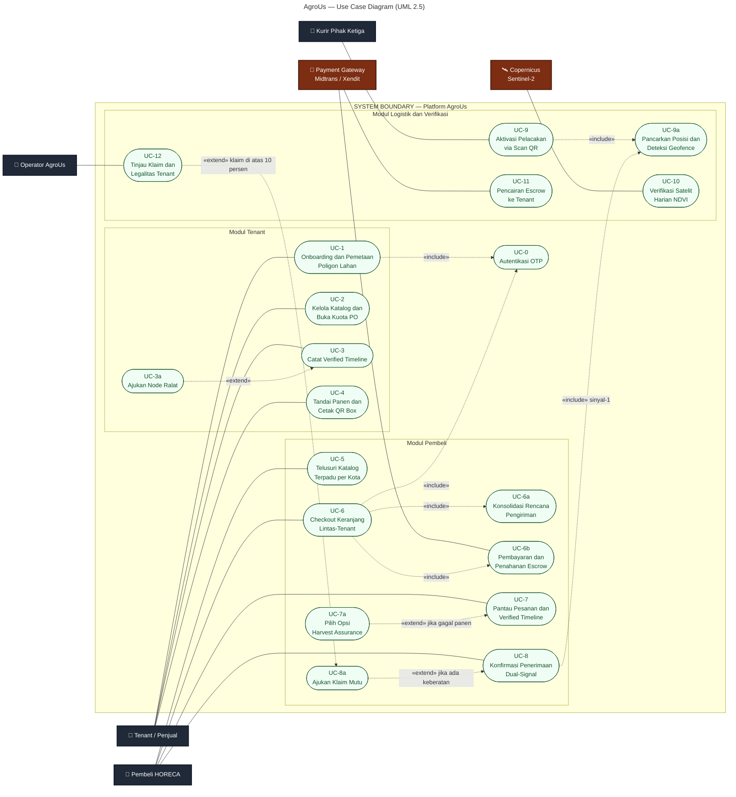

# AgroUs — Use Case Diagram (UML 2.5)

> Aktor primer: Tenant/Penjual, Pembeli HORECA, Kurir Pihak Ketiga.
> Aktor sekunder & sistem eksternal: Operator AgroUs, Payment Gateway (Midtrans/Xendit), Copernicus Sentinel-2.

