# AgroUs — Activity Diagram: Siklus Hidup Pesanan (UML 2.5)

> Empat fase: (1) Transaksi & Escrow, (2) Budidaya & Verifikasi Satelit (paralel),
> (3) Logistik Zero-Install, (4) Dual-Signal PoD & Penyelesaian.

```mermaid
---
title: "AgroUs — Activity Diagram: Siklus Hidup Pesanan (UML 2.5)"
---
flowchart TB
    START(("●")) --> A1

    subgraph F1["FASE 1 — TRANSAKSI DAN ESCROW"]
        A1["Pembeli: susun keranjang lintas-Tenant<br/>dan rencana pengiriman terkonsolidasi"]
        A1 --> D1{"Nilai order memenuhi<br/>minimum zona?"}
        D1 -- "Tidak" --> A2["Sistem: blokir checkout,<br/>sarankan tambah item"] --> A1
        D1 -- "Ya" --> A3["Sistem: reservasi kuota batch"]
        A3 --> D2{"Kuota batch tersedia?"}
        D2 -- "Ya" --> A4["Sistem: buat tagihan via Payment Gateway<br/>QRIS / VA / E-Wallet"]
        A4 --> D3{"Pembayaran tervalidasi<br/>sebelum kedaluwarsa?"}
        D3 -- "Tidak atau timeout" --> A5["Sistem: lepas reservasi kuota"]
        D3 -- "Ya" --> A6["Sistem: tahan dana di escrow mitra<br/>status = Menunggu Panen"]
    end

    D2 -- "Tidak" --> FAIL1
    A5 --> FAIL1

    A6 --> FORK["«fork» — dua proses berjalan paralel"]

    subgraph F2["FASE 2 — BUDIDAYA DAN VERIFIKASI SATELIT (PARALEL)"]
        FORK --> B1["Tenant: input node timeline<br/>jenis + deskripsi + foto kamera + GPS"]
        B1 --> D4{"Elemen wajib lengkap<br/>dan GPS dalam poligon?"}
        D4 -- "Tidak" --> B2["Sistem: tolak simpan, atau wajib<br/>alasan tertulis yang tampil ke Pembeli"] --> B1
        D4 -- "Ya" --> B3["Sistem: simpan node append-only<br/>dengan rantai hash SHA-256"]
        B3 --> D5{"Node = Panen?"}
        D5 -- "Belum" --> B1

        FORK --> C1["Sistem: job harian tarik scene<br/>Sentinel-2 untuk poligon aktif"]
        C1 --> D6{"Tutupan awan maksimal 40%?"}
        D6 -- "Tidak" --> C2["Badge = Tidak Dapat Diverifikasi<br/>bukti foto menjadi lapis kedua"]
        D6 -- "Ya" --> C3["Hitung deret NDVI/NDMI<br/>vs klaim tanggal tanam dan panen"]
        C3 --> D7{"Selisih tanggal<br/>klaim vs deteksi?"}
        D7 -- "kurang dari 7 hari" --> C4["Badge = Terverifikasi Satelit"]
        D7 -- "7 sampai 21 hari" --> C5["Badge = Perlu Ditinjau<br/>selisih tampil terbuka"]
        D7 -- "lebih dari 21 hari" --> C6["Badge = Tidak Sesuai<br/>selisih tampil terbuka"]
    end

    D5 -- "Ya" --> JOIN
    C2 --> JOIN
    C4 --> JOIN
    C5 --> JOIN
    C6 --> JOIN
    JOIN["«join» — sinkronisasi"]

    JOIN --> D8{"Panen berhasil?"}
    D8 -- "Tidak" --> H1["Harvest Assurance:<br/>Pembeli memilih opsi"]
    H1 --> D9{"Opsi Pembeli"}
    D9 -- "Substitusi Tenant lain,<br/>harga terkunci" --> E1
    D9 -- "Jadwal ulang<br/>siklus berikutnya" --> FORK
    D9 -- "Refund penuh" --> R1["Sistem: kembalikan escrow<br/>via Payment Gateway"] --> REF
    D8 -- "Ya" --> E1["Tenant: cetak QR unik per box<br/>tombol aktif hanya pasca-Panen"]

    subgraph F3["FASE 3 — LOGISTIK ZERO-INSTALL"]
        E2["Kurir: scan QR dengan kamera bawaan"]
        E2 --> D10{"Token sesi valid<br/>dan belum terpakai?"}
        D10 -- "Tidak" --> E3["Tolak akses: QR tidak berlaku,<br/>hubungi Tenant"] --> E2
        D10 -- "Ya" --> E4["Status = Dikirim<br/>notifikasi ke Pembeli"]
        E4 --> D11{"Izin lokasi browser<br/>diberikan?"}
        D11 -- "Tidak" --> E5["Mode tanpa live-tracking:<br/>jalur konfirmasi manual tetap ada"]
        D11 -- "Ya" --> E6["Loop kirim posisi tiap 10 detik<br/>+ cek kewajaran anti-spoof"]
        E6 --> D12{"Sinyal terputus?"}
        D12 -- "Ya" --> E7["Tampilkan posisi terakhir<br/>dengan stempel waktu jujur"] --> E6
        D12 -- "Tidak" --> D13{"Jarak maksimal 100 m<br/>dari titik tujuan?"}
        D13 -- "Belum" --> E6
        D13 -- "Ya" --> E8["Status = Tiba di Lokasi<br/>push notifikasi ke Pembeli"]
    end

    E1 --> E2
    E5 --> E8

    subgraph F4["FASE 4 — DUAL-SIGNAL POD DAN PENYELESAIAN"]
        E8 --> D14{"Pembeli konfirmasi<br/>dalam 60 menit?"}
        D14 -- "Ya" --> G1["Konfirmasi 1-ketuk + foto kondisi<br/>status = Diterima, jendela klaim 2 jam"]
        D14 -- "Tidak, timeout" --> G2["Status = Diterima Otomatis<br/>jendela klaim diperpanjang 24 jam"]
        G1 --> D15{"Klaim diajukan<br/>dalam jendela?"}
        G2 --> D15
        D15 -- "Tidak" --> G3["Status = Selesai"]
        D15 -- "Ya" --> G4["Pembeli: ajukan klaim<br/>foto + berat hasil timbang"]
        G4 --> D16{"Selisih melebihi toleransi susut?<br/>5% daun, 3% buah-umbi"}
        D16 -- "Tidak" --> G5["Klaim ditolak otomatis<br/>masih dalam toleransi"] --> G3
        D16 -- "Ya" --> D17{"Nilai klaim maksimal<br/>10% nilai order?"}
        D17 -- "Ya" --> G6["Potong escrow otomatis"] --> G3
        D17 -- "Tidak" --> G7["Antrean tinjauan Operator<br/>SLA 1 hari kerja"] --> G8["Penyesuaian escrow<br/>sesuai putusan"] --> G3
        G3 --> G9["Sistem: cairkan escrow ke Tenant<br/>via Payment Gateway"]
    end

    G9 --> SUCC((("✓ Selesai<br/>Escrow Cair ke Tenant")))
    FAIL1((("✕ Pesanan Gagal<br/>Dana Tidak Ditarik")))
    REF((("↩ Refund Penuh<br/>ke Pembeli")))

    classDef startEnd fill:#1F2937,color:#ffffff,stroke:#111827;
    classDef fail fill:#FEF2F2,color:#B91C1C,stroke:#B91C1C;
    classDef ok fill:#F0FDF4,color:#14532D,stroke:#14532D,stroke-width:2px;
    classDef bar fill:#1F2937,color:#ffffff,stroke:#111827;
    class START startEnd;
    class FAIL1,REF fail;
    class SUCC ok;
    class FORK,JOIN bar;
```

