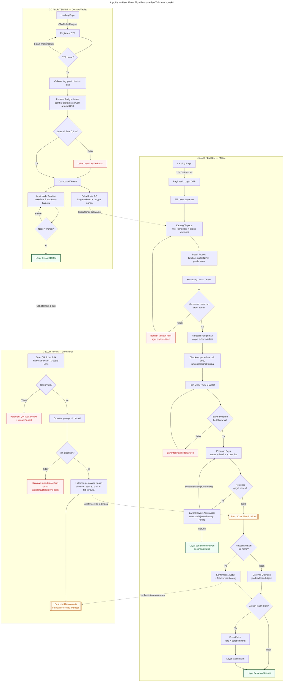

# AgroUs — User Flow: Tiga Persona dan Titik Interkoneksi

> Alur Tenant (Desktop/Tablet), Pembeli (Mobile), dan Kurir (Zero-Install),
> beserta titik interkoneksi antar persona (garis putus-putus).

