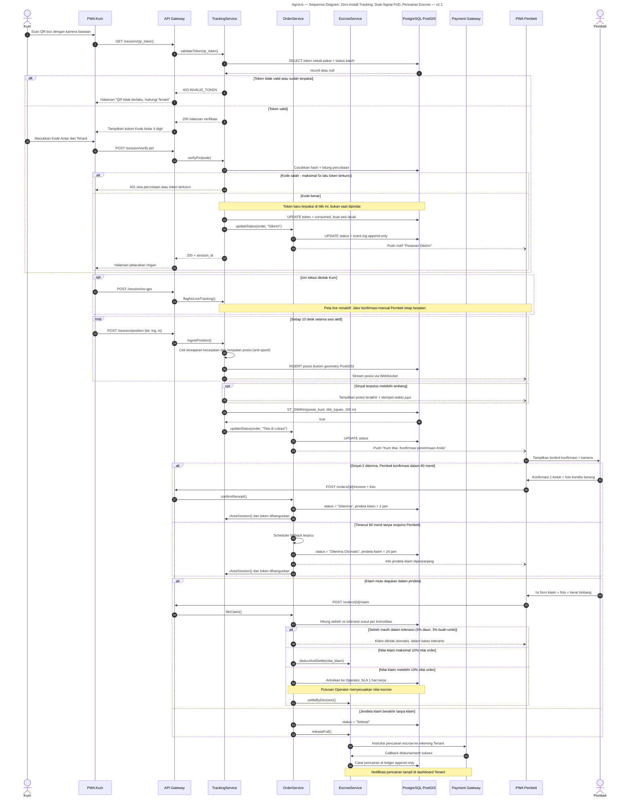

# AgroUs — Sequence Diagram: Zero-Install Tracking, Dual-Signal PoD, Pencairan Escrow — v2.1

> Alur runtime dari scan QR kurir → **verifikasi Kode Antar** → pelacakan posisi → geofence →
> konfirmasi pembeli (dual-signal PoD) → jendela klaim mutu → pencairan escrow ke Tenant.
>
> **v2.1:** blok `verifyPin` disisipkan setelah token valid. Perhatikan `Note`: token baru
> ditandai `consumed` **di titik kode benar**, bukan saat dipindai — sehingga pemindaian iseng
> tidak menghanguskan token.

