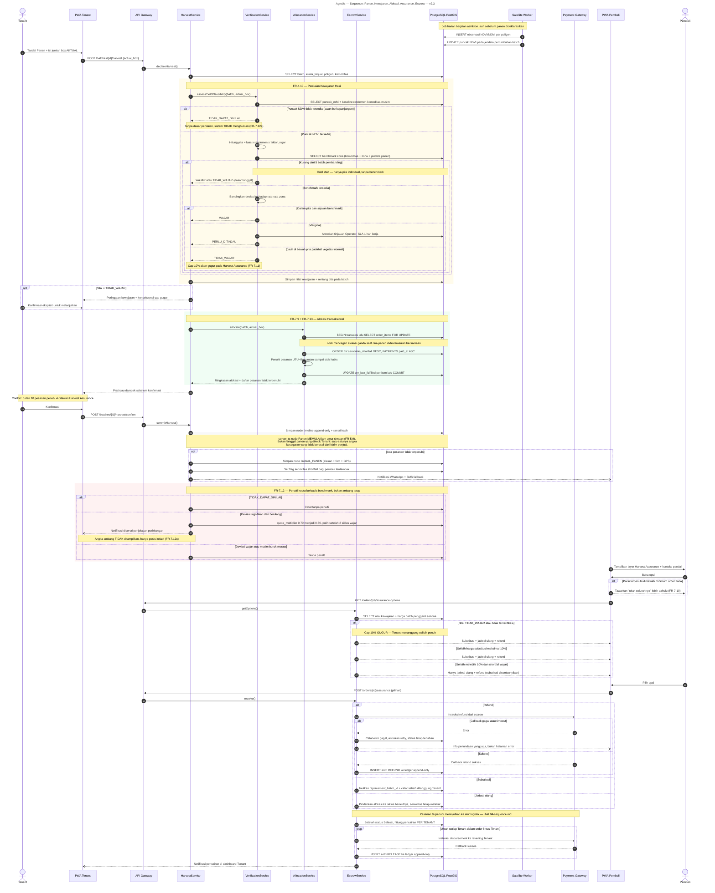

# AgroUs — Sequence Diagram: Panen → Kewajaran → Alokasi → Assurance → Escrow — v2.3

> **Mengapa sequence ini baru.** Seluruh perubahan v2.3 (pita kewajaran, benchmark, senioritas shortfall)
> berada di alur **panen sampai penyelesaian**, yang pada dokumen v2.2 belum memiliki sequence sama sekali.
> Sequence logistik yang sudah ada — [`04-sequence.md`](04-sequence.md): scan QR → Kode Antar → tracking →
> Dual-Signal PoD — **tetap berlaku tanpa perubahan struktural** dan menjadi pendamping dokumen ini.
>
> Lapisan mengikuti Clean Architecture: **Actor → UI (PWA) → API Gateway → Service → Repository/DB**,
> ditambah dua sistem eksternal (Satellite Worker, Payment Gateway).
>
> **Edge case yang ditangani eksplisit:** puncak NDVI tidak tersedia (awan), benchmark belum cukup
> (< 5 batch pembanding), laporan di luar pita, penilaian marginal → antrean Operator, alokasi bersamaan
> (race condition), porsi terpenuhi di bawah minimum order zona, dan kegagalan disbursement gateway.

## Poin Penting

**1. Satellite Worker muncul di awal, bukan saat panen.** Dua pesan pertama menegaskan bahwa NDVI dikumpulkan **asinkron dan jauh sebelumnya**. Kalau penilaian kewajaran harus menunggu tarikan satelit saat itu juga, Tenant akan berdiri di kebun menunggu langit cerah — dan itu persis yang FR-4.9 larang.

**2. Blok `alt` bersarang tiga lapis pada penilaian kewajaran bukan hiasan.** Tiga kegagalan berbeda ditangani berbeda: tidak ada NDVI → tidak dinilai; ada NDVI tapi zona sepi → dasar tunggal; lengkap → penilaian penuh. Sistem yang meruntuhkan ketiganya menjadi satu "gagal" akan menghukum Tenant karena mendung.

**3. `SELECT ... FOR UPDATE` ditampilkan eksplisit.** Alokasi adalah titik race condition paling nyata di sistem ini — dua batch dideklarasikan panen bersamaan pada order yang beririsan akan menghasilkan double-allocation tanpa lock. Ini detail implementasi yang layak terlihat di diagram karena melanggarnya menghasilkan kerugian uang, bukan sekadar bug tampilan.

**4. Urutan `ORDER BY` ditulis apa adanya.** `senioritas_shortfall DESC, paid_at ASC` — dua kolom, satu klausa. Inilah seluruh implementasi FR-7.13, dan menampilkannya mencegah developer menafsirkannya sebagai sistem antrean terpisah.

**5. Kegagalan disbursement punya jalurnya sendiri.** Callback gateway gagal → entri dicatat, dana **tetap tertahan**, retry diantrekan, pembeli diberi info jujur. Bandingkan dengan diagram happy-path yang berhenti di "callback sukses" — di sistem yang memegang uang orang, jalur inilah yang paling sering dipakai di dunia nyata.

**6. `loop` pencairan per Tenant menutup ketidaksesuaian v2.2.** Sequence lama menampilkan satu instruksi pencairan tunggal padahal order bersifat lintas-Tenant dan ERD sudah menyediakan `ESCROW_LEDGER.tenant_id`. Sekarang diagram, ERD, dan FR-7.2 mengatakan hal yang sama.

**7. Tidak ada angka ambang di seluruh diagram.** `Note` pada blok penalti menyatakannya eksplisit. Diagram ini aman ditayangkan ke publik — sebuah persyaratan produk, bukan kebetulan.
