# AgroUs — Entity Relationship Diagram (PostgreSQL + PostGIS) — v2.2

> Skema data v2.2. Menggunakan PostGIS untuk `geometry` (poligon lahan, titik GPS, geofence).
> Entitas kunci: append-only `TIMELINE_NODES` (rantai hash SHA-256), `SATELLITE_OBSERVATIONS`
> (NDVI/NDMI), `ESCROW_LEDGER` (append-only), dan `DEMAND_AGGREGATES` (materialized view).
>
> **v2.1:** `SHIPMENTS` menambah `courier_pin_hash` + `pin_attempts` (Kode Antar, FR-6.1/6.3);
> `BOX_QR_TOKENS.consumed_at` kini terisi **setelah kode terverifikasi** (FR-6.2), bukan saat dipindai.
>
> **v2.2 — Panen Sebagian:** `BATCHES.quota_box_fulfilled`, `ORDER_ITEMS.qty_box_fulfilled`,
> `ASSURANCE_RESOLUTIONS.shortfall_box` + `price_gap_borne_by_tenant`.
> `PAYMENTS.paid_at` menjadi **kunci urutan alokasi FIFO** (FR-7.9). `TENANTS.shortfall_ratio_cached`
> untuk penalti kuota (FR-7.12). `activity_type` bertambah `GAGAL_PANEN` → **7 jenis** (FR-4.9).
> `SUBSCRIPTIONS.grace_until` (FR-9.4).
>
> **Catatan:** `production_status` **tidak** menambah nilai baru. Panen sebagian diturunkan dari
> `quota_box_fulfilled < quota_box_sold` — satu sumber kebenaran, menghindari status dan angka jadi tidak sinkron.
> `ESCROW_LEDGER` juga tidak butuh `entry_type` baru: `RELEASE` untuk porsi terpenuhi, `REFUND` untuk shortfall.

```mermaid
---
title: "AgroUs — Entity Relationship Diagram (PostgreSQL + PostGIS) — v2.2"
---
erDiagram
    USERS {
        uuid id PK
        text phone UK "login OTP - FR-1.3"
        text email "opsional"
        text role "TENANT / BUYER / OPERATOR"
        timestamptz created_at
    }

    TENANTS {
        uuid id PK
        uuid user_id FK,UK
        text company_name
        text logo_url
        text legality_status "PENDING / APPROVED / REJECTED - FR-1.7"
        uuid reviewed_by FK "operator peninjau"
        numeric claim_ratio_cached "tampil publik - FR-5.7"
        numeric shortfall_ratio_cached "rolling 2 siklus - tampil publik - FR-7.12"
        numeric quota_multiplier "0.70 normal - turun 0.50 jika shortfall lebih 15 persen - FR-7.12"
    }

    BUYERS {
        uuid id PK
        uuid user_id FK,UK
        text company_name
        uuid active_zone_id FK "kota layanan - FR-2.1"
    }

    ZONES {
        uuid id PK
        text name
        text city
        int min_order_value "gerbang unit economics - Risiko 3"
    }

    TENANT_ZONES {
        uuid tenant_id PK,FK
        uuid zone_id PK,FK
    }

    COMMODITIES {
        uuid id PK
        text name
        text category "DAUN / BUAH_UMBI / KERING"
        numeric shrink_tolerance_pct "5 daun - 3 buah umbi - FR-5.2"
        numeric avg_yield_kg_per_ha "basis pembatas kuota - FR-3.3"
        jsonb grade_standards "definisi A B C per komoditas - FR-5.1"
    }

    LAND_PLOTS {
        uuid id PK
        uuid tenant_id FK
        geometry polygon "PostGIS - FR-1.5"
        numeric area_ha
        text capture_method "GAMBAR_PETA / WALK_AROUND"
        text verification_tier "NORMAL / TERBATAS jika kurang 0.1 ha - FR-1.6"
    }

    PRODUCTS {
        uuid id PK
        uuid tenant_id FK
        uuid commodity_id FK
        text name
        text grade "A / B / C"
        int price_per_box
        numeric qty_kg_per_box
        int stock_box
        date est_harvest_date
    }

    BATCHES {
        uuid id PK
        uuid product_id FK
        uuid land_plot_id FK "satu batch satu poligon - FR-3.4"
        date claimed_plant_date
        date claimed_harvest_date
        int quota_box_total "CHECK maks 70 persen kapasitas lahan"
        int quota_box_sold
        int quota_box_fulfilled "hasil panen aktual - FR-7.8 - FAILED implies 0"
        int locked_price "harga terkunci PO"
        text production_status "PLANNING / GROWING / HARVESTED / FAILED"
        text verification_status "TERVERIFIKASI / FOTO_SAJA / PERLU_DITINJAU / TIDAK_DAPAT / TIDAK_SESUAI"
        date detected_plant_date "hasil NDVI"
        date detected_harvest_date "hasil NDVI"
    }

    TIMELINE_NODES {
        uuid id PK
        uuid batch_id FK
        int seq
        text activity_type "7 jenis terstruktur termasuk GAGAL_PANEN - 5.4.1 FR-4.9"
        text description "maks 280 karakter"
        geometry gps_point "wajib dalam poligon - FR-4.3"
        timestamptz device_ts
        timestamptz server_ts
        text prev_hash
        text node_hash UK "SHA-256 berantai"
        uuid ralat_of FK "self-reference - FR-4.2"
        text outside_polygon_reason "tampil ke pembeli"
    }

    NODE_PHOTOS {
        uuid id PK
        uuid node_id FK
        text object_url
        text photo_type "KEGIATAN / NOTA_INPUT - FR-4.7"
        text capture_source "IN_APP_CAMERA / GALLERY"
        numeric exif_lat
        numeric exif_lng
        timestamptz exif_ts
        text sha256
    }

    SATELLITE_OBSERVATIONS {
        uuid id PK
        uuid land_plot_id FK
        date scene_date
        numeric cloud_pct "dibuang jika lebih 40 persen"
        numeric ndvi_mean
        numeric ndmi_mean
        boolean usable
    }

    HASH_ANCHORS {
        uuid id PK
        uuid batch_id FK
        date anchor_date
        text root_hash
        text external_ref "penyimpanan write-once eksternal - 6.1"
        timestamptz published_at
    }

    SUBSCRIPTIONS {
        uuid id PK
        uuid tenant_id FK
        text plan "VERIFIED"
        int price_month "Rp199000 - Sumber 2"
        date period_start
        date period_end
        date grace_until "tenggang 14 hari - FR-9.4"
        text status "gerbang verifikasi BATCH BARU saja - badge lama permanen FR-9.2"
    }

    ORDERS {
        uuid id PK
        uuid buyer_id FK
        int total_amount
        text order_status "DRAFT / PAID / CLOSED"
        timestamptz created_at
    }

    ORDER_ITEMS {
        uuid id PK
        uuid order_id FK
        uuid shipment_id FK
        uuid batch_id FK
        int qty_box
        int qty_box_fulfilled "hasil alokasi FIFO - FR-7.9"
        int unit_price_locked
        int subtotal
    }

    SHIPMENTS {
        uuid id PK
        uuid order_id FK
        uuid zone_id FK
        geometry dest_point "snapshot titik checkout - FR-2.7"
        int dest_radius_m "default 100 - 5.6.3"
        text receiving_hours "jam operasional terima"
        text status "7 status termasuk DIBATALKAN - 5.6.1 dan FR-7.5"
        text courier_pin_hash "Kode Antar 4 digit disimpan hash - FR-6.1"
        int pin_attempts "maks 5 percobaan lalu terkunci - FR-6.3"
        text received_mode "BUYER_CONFIRM / AUTO_60MIN"
        text pod_photo_url "sinyal-2 dual-signal"
        timestamptz arrived_at
        timestamptz claim_window_ends_at "2 jam atau 24 jam"
        timestamptz completed_at
    }

    PAYMENTS {
        uuid id PK
        uuid order_id FK
        text gateway "MIDTRANS / XENDIT"
        text method "QRIS / VA / EWALLET"
        text invoice_ref
        int amount
        text status "PENDING / PAID / EXPIRED / FAILED"
        timestamptz expires_at "timeout D3 activity"
        timestamptz paid_at "KUNCI URUTAN ALOKASI FIFO - FR-7.9"
    }

    ESCROW_LEDGER {
        uuid id PK
        uuid order_id FK
        uuid shipment_id FK "nullable"
        uuid tenant_id FK "tujuan pencairan per tenant"
        text entry_type "HOLD / RELEASE30 / POTONG_KLAIM / RELEASE / REFUND / BIAYA_BATAL10"
        int amount
        text gateway_ref
        timestamptz created_at "append-only ledger"
    }

    BOX_QR_TOKENS {
        uuid id PK
        uuid order_item_id FK
        text token UK "sekali pakai - FR-3.6"
        timestamptz printed_at "hanya pasca Panen"
        timestamptz consumed_at "terpakai setelah kode terverifikasi - FR-6.2"
    }

    TRACKING_SESSIONS {
        uuid id PK
        uuid shipment_id FK
        uuid activation_token_id FK
        boolean no_gps_mode "izin lokasi ditolak - 6.3"
        timestamptz started_at
        timestamptz ended_at
        text ended_reason "BUYER_CONFIRM / EXPIRED"
    }

    TRACKING_POSITIONS {
        uuid id PK
        uuid session_id FK
        geometry point "PostGIS"
        timestamptz device_ts
        timestamptz server_ts
        boolean is_plausible "anti-spoof kecepatan dan lompatan"
    }

    CLAIMS {
        uuid id PK
        uuid shipment_id FK
        text description
        text photo_url
        numeric actual_weight_kg "hasil timbang - FR-5.4"
        int claim_value
        numeric pct_of_order
        text route "TOLAK_TOLERANSI / AUTO_SETTLE / OPERATOR - FR-5.5 5.6"
        uuid reviewed_by FK "operator jika lebih 10 persen"
        timestamptz sla_due_at "1 hari kerja"
        text final_status
    }

    ASSURANCE_RESOLUTIONS {
        uuid id PK
        uuid order_item_id FK,UK
        uuid failed_batch_id FK
        text chosen_option "SUBSTITUSI / JADWAL_ULANG / REFUND / TERIMA_SEBAGIAN - FR-7.4 7.10"
        int shortfall_box "porsi tidak terpenuhi - FR-7.10"
        int price_gap_borne_by_tenant "cap 10 persen - gugur jika tak terverifikasi - FR-7.11"
        uuid replacement_batch_id FK "nullable"
        timestamptz resolved_at
    }

    TRACEABILITY_REPORTS {
        uuid id PK
        uuid buyer_id FK
        uuid shipment_id FK
        text pdf_url
        int price "Rp25000 - Sumber 3"
        text paid_ref "dibundel di tagihan checkout - FR-2.10"
    }

    DEMAND_AGGREGATES {
        uuid zone_id FK "MATERIALIZED VIEW - FR-8.1"
        uuid commodity_id FK
        date harvest_week
        int demanded_box
        int open_quota_box
        int gap_box "tampil di Rekomendasi Tanam - FR-8.2"
        numeric saturation_pct "indikator panen raya - FR-8.4"
        int est_locked_price
    }

    %% ============ RELASI ============
    USERS ||--o| TENANTS : "memiliki profil"
    USERS ||--o| BUYERS : "memiliki profil"
    USERS o|--o{ TENANTS : "meninjau legalitas"
    USERS o|--o{ CLAIMS : "memutus klaim besar"

    TENANTS ||--|{ LAND_PLOTS : "memetakan"
    TENANTS ||--o{ PRODUCTS : "menjual"
    TENANTS ||--o{ SUBSCRIPTIONS : "berlangganan"
    TENANTS ||--o{ TENANT_ZONES : "melayani"
    ZONES ||--o{ TENANT_ZONES : "dilayani"
    ZONES ||--o{ BUYERS : "dipilih"

    COMMODITIES ||--o{ PRODUCTS : "mengklasifikasi"
    PRODUCTS ||--o{ BATCHES : "diproduksi dalam"
    LAND_PLOTS ||--o{ BATCHES : "menumbuhkan"
    LAND_PLOTS ||--o{ SATELLITE_OBSERVATIONS : "diamati"

    BATCHES ||--o{ TIMELINE_NODES : "didokumentasikan"
    TIMELINE_NODES ||--o{ NODE_PHOTOS : "dibuktikan"
    TIMELINE_NODES o|--o{ TIMELINE_NODES : "meralat"
    BATCHES ||--o{ HASH_ANCHORS : "dijangkar harian"

    BUYERS ||--o{ ORDERS : "membuat"
    ORDERS ||--|{ ORDER_ITEMS : "berisi"
    ORDERS ||--|{ SHIPMENTS : "dikelompokkan"
    ORDERS ||--o{ PAYMENTS : "ditagih"
    ORDERS ||--o{ ESCROW_LEDGER : "dibukukan"
    TENANTS ||--o{ ESCROW_LEDGER : "menerima pencairan"
    SHIPMENTS ||--o{ ORDER_ITEMS : "mengangkut"
    BATCHES ||--o{ ORDER_ITEMS : "memenuhi kuota"
    ZONES ||--o{ SHIPMENTS : "menzonakan"

    ORDER_ITEMS ||--o{ BOX_QR_TOKENS : "dilabeli"
    BOX_QR_TOKENS ||--o| TRACKING_SESSIONS : "mengaktivasi"
    SHIPMENTS ||--o{ TRACKING_SESSIONS : "dilacak"
    TRACKING_SESSIONS ||--o{ TRACKING_POSITIONS : "merekam"

    SHIPMENTS ||--o{ CLAIMS : "diklaim"
    ORDER_ITEMS ||--o| ASSURANCE_RESOLUTIONS : "diselamatkan"
    BATCHES o|--o{ ASSURANCE_RESOLUTIONS : "menggantikan"

    BUYERS ||--o{ TRACEABILITY_REPORTS : "membeli"
    SHIPMENTS ||--o{ TRACEABILITY_REPORTS : "dilaporkan"

    ZONES ||--o{ DEMAND_AGGREGATES : "diagregasi"
    COMMODITIES ||--o{ DEMAND_AGGREGATES : "diagregasi"
```

