# AgroUs — Entity Relationship Diagram (PostgreSQL + PostGIS) — v2.3

> Skema data v2.3. Menggunakan PostGIS untuk `geometry` (poligon lahan, titik GPS, geofence).
> Entitas kunci: append-only `TIMELINE_NODES` (rantai hash SHA-256), `SATELLITE_OBSERVATIONS`
> (NDVI/NDMI), `ESCROW_LEDGER` (append-only), dan dua materialized view (`DEMAND_AGGREGATES`,
> `ZONE_YIELD_BENCHMARK`).
>
> **v2.1:** `SHIPMENTS.courier_pin_hash` + `pin_attempts`; `BOX_QR_TOKENS.consumed_at` terisi
> **setelah kode terverifikasi**, bukan saat dipindai.
>
> **v2.2:** `BATCHES.quota_box_fulfilled`, `ORDER_ITEMS.qty_box_fulfilled`,
> `ASSURANCE_RESOLUTIONS.shortfall_box`, `PAYMENTS.paid_at` sebagai kunci FIFO,
> `activity_type` bertambah `GAGAL_PANEN` → 7 jenis.
>
> **v2.3 — empat entitas baru + tiga kolom:**
> 1. **`YIELD_ASSESSMENTS`** — riwayat penilaian kewajaran per batch (FR-4.10, FR-7.12a).
>    Dibuat sebagai tabel tersendiri, bukan kolom di `BATCHES`, karena satu batch dapat dinilai
>    ulang saat scene satelit baru tiba dan halaman TN-35 menuntut riwayatnya.
> 2. **`COMMODITY_SEASON_BASELINES`** — kurva vegetasi & rendemen acuan per komoditas per musim.
>    Inilah aset kalibrasi yang disebut §6.2 poin 8 sebagai moat teknis.
> 3. **`ZONE_YIELD_BENCHMARK`** *(materialized view)* — rata-rata realisasi lintas-Tenant
>    per komoditas + zona + jendela panen (FR-7.12b). Minimal 5 batch pembanding (FR-7.12e).
> 4. **`SHORTFALL_SENIORITY`** — hak prioritas alokasi satu siklus bagi pembeli yang dirugikan (FR-7.13).
>    Berpasangan **buyer × tenant**, bukan flag global, karena senioritas hanya berlaku pada
>    Tenant yang sama.
>
> **Catatan yang tidak boleh dilanggar:**
> - `production_status` **tidak** menambah nilai baru. Panen sebagian tetap diturunkan dari
>   `quota_box_fulfilled < quota_box_sold` — satu sumber kebenaran.
> - **Tidak ada kolom `threshold` atau `ambang` di mana pun.** Ambang deviasi adalah parameter
>   konfigurasi sisi server, bukan data (FR-7.12c). Menyimpannya di basis data mengundangnya bocor ke UI.
> - `ESCROW_LEDGER` tetap tanpa `entry_type` baru: `RELEASE` untuk porsi terpenuhi, `REFUND` untuk shortfall.

```mermaid
---
title: "AgroUs — Entity Relationship Diagram (PostgreSQL + PostGIS) — v2.3"
---
erDiagram
    USERS {
        uuid id PK
        text phone UK "login OTP - FR-1.3"
        text email "opsional"
        text role "TENANT / BUYER / OPERATOR"
        timestamptz created_at
    }

    TENANTS {
        uuid id PK
        uuid user_id FK,UK
        text company_name
        text logo_url
        text legality_status "PENDING / APPROVED / REJECTED - FR-1.7"
        uuid reviewed_by FK "operator peninjau"
        numeric claim_ratio_cached "tampil publik - FR-5.7"
        numeric yield_position_cached "posisi relatif terhadap rata-rata zona - FR-7.12f"
        numeric quota_multiplier "0.70 normal - 0.50 setelah deviasi berulang - FR-7.12d"
        int clean_cycles_streak "pemulihan setelah 2 siklus wajar - FR-7.12d"
    }

    BUYERS {
        uuid id PK
        uuid user_id FK,UK
        text company_name
        uuid active_zone_id FK "kota layanan - FR-2.1"
    }

    ZONES {
        uuid id PK
        text name
        text city
        int min_order_value "gerbang unit economics - Risiko 3"
    }

    TENANT_ZONES {
        uuid tenant_id PK,FK
        uuid zone_id PK,FK
    }

    COMMODITIES {
        uuid id PK
        text name
        text category "DAUN / BUAH_UMBI / KERING"
        boolean ambient_stable "true untuk komoditas MVP - daun false - 11.2"
        numeric shrink_tolerance_pct "3 persen untuk komoditas MVP - FR-5.2"
        numeric avg_yield_kg_per_ha "basis pembatas kuota dan pita kewajaran - FR-3.3 FR-4.10"
        jsonb grade_standards "definisi A B C per komoditas - FR-5.1"
    }

    COMMODITY_SEASON_BASELINES {
        uuid id PK
        uuid commodity_id FK
        text season "MUSIM_HUJAN / MUSIM_KEMARAU"
        numeric ndvi_peak_reference "puncak NDVI acuan tanaman sehat"
        jsonb vigor_curve_params "pemetaan puncak NDVI ke faktor vigor - 6.2 poin 6"
        int typical_cycle_days "validasi kewajaran rentang tanam-panen - FR-4.8"
        text calibration_source "wajib divalidasi penyuluh atau BPS - 6.2 poin 8"
    }

    LAND_PLOTS {
        uuid id PK
        uuid tenant_id FK
        geometry polygon "PostGIS - FR-1.5"
        numeric area_ha
        numeric effective_area_ha "luas setelah buang piksel tepi - dasar pita kewajaran"
        text capture_method "GAMBAR_PETA / WALK_AROUND"
        text verification_tier "NORMAL / TERBATAS jika kurang 0.1 ha - FR-1.6"
    }

    PRODUCTS {
        uuid id PK
        uuid tenant_id FK
        uuid commodity_id FK
        text name
        text grade "A / B / C"
        int price_per_box
        numeric qty_kg_per_box
        int stock_box
        date est_harvest_date
    }

    BATCHES {
        uuid id PK
        uuid product_id FK
        uuid land_plot_id FK "satu batch satu poligon - FR-3.4"
        date claimed_plant_date
        date claimed_harvest_date
        int quota_box_total "CHECK maks 70 persen kapasitas x quota_multiplier"
        int quota_box_sold
        int quota_box_fulfilled "hasil panen aktual dilaporkan Tenant - FR-7.8"
        int locked_price "harga terkunci PO"
        text production_status "PLANNING / GROWING / HARVESTED / FAILED"
        text verification_status "TERVERIFIKASI / FOTO_SAJA / PERLU_DITINJAU / TIDAK_DAPAT / TIDAK_SESUAI"
        date detected_plant_date "hasil NDVI"
        date detected_harvest_date "hasil NDVI"
        numeric peak_ndvi "puncak jendela pertumbuhan - masukan pita kewajaran FR-4.10"
        text plausibility_cached "salinan verdict terkini dari YIELD_ASSESSMENTS"
    }

    YIELD_ASSESSMENTS {
        uuid id PK
        uuid batch_id FK
        timestamptz assessed_at
        int reported_box "angka yang dilaporkan Tenant"
        numeric expected_yield_min "batas bawah pita - sengaja lebar"
        numeric expected_yield_max "batas atas pita"
        numeric peak_ndvi_used
        numeric zone_benchmark_ratio "nullable jika benchmark belum tersedia"
        text basis "PITA_SAJA / PITA_PLUS_BENCHMARK / TIDAK_ADA_DASAR - FR-7.12e"
        text verdict "WAJAR / PERLU_DITINJAU / TIDAK_WAJAR / TIDAK_DAPAT_DINILAI"
        uuid reviewed_by FK "operator jika PERLU_DITINJAU - FR-7.12a"
        timestamptz sla_due_at "1 hari kerja"
        text final_verdict "setelah tinjauan operator"
    }

    TIMELINE_NODES {
        uuid id PK
        uuid batch_id FK
        int seq
        text activity_type "7 jenis termasuk GAGAL_PANEN - 5.4.1 FR-4.9"
        text description "maks 280 karakter"
        geometry gps_point "wajib dalam poligon - FR-4.3"
        timestamptz device_ts
        timestamptz server_ts
        text prev_hash
        text node_hash UK "SHA-256 berantai"
        uuid ralat_of FK "self-reference - FR-4.2"
        text failure_reason "CUACA / HAMA / PENYAKIT / LAINNYA - FR-4.9"
        text outside_polygon_reason "tampil ke pembeli"
    }

    NODE_PHOTOS {
        uuid id PK
        uuid node_id FK
        text object_url
        text photo_type "KEGIATAN / NOTA_INPUT - FR-4.7"
        text capture_source "IN_APP_CAMERA / GALLERY"
        numeric exif_lat
        numeric exif_lng
        timestamptz exif_ts
        text sha256
    }

    SATELLITE_OBSERVATIONS {
        uuid id PK
        uuid land_plot_id FK
        date scene_date
        numeric cloud_pct "dibuang jika lebih 40 persen"
        numeric ndvi_mean
        numeric ndmi_mean
        boolean usable
    }

    HASH_ANCHORS {
        uuid id PK
        uuid batch_id FK
        date anchor_date
        text root_hash
        text external_ref "penyimpanan write-once eksternal - 6.1"
        timestamptz published_at
    }

    SUBSCRIPTIONS {
        uuid id PK
        uuid tenant_id FK
        text plan "VERIFIED"
        int price_month "Rp199000 - bergantung validasi A2"
        date period_start
        date period_end
        date grace_until "tenggang 14 hari - FR-9.4"
        text status "gerbang verifikasi BATCH BARU saja - badge lama permanen FR-9.2"
    }

    ORDERS {
        uuid id PK
        uuid buyer_id FK
        int total_amount
        boolean traceability_report_opted "dibundel di checkout - FR-2.10"
        text order_status "DRAFT / PAID / CLOSED"
        timestamptz created_at
    }

    ORDER_ITEMS {
        uuid id PK
        uuid order_id FK
        uuid shipment_id FK
        uuid batch_id FK
        int qty_box
        int qty_box_fulfilled "hasil alokasi - FR-7.9"
        boolean seniority_applied "true jika dialokasikan lewat senioritas - FR-7.13"
        int unit_price_locked
        int subtotal
    }

    SHORTFALL_SENIORITY {
        uuid id PK
        uuid buyer_id FK
        uuid tenant_id FK "berlaku hanya pada Tenant yang sama - FR-7.13"
        uuid source_order_item_id FK "shortfall asal"
        timestamptz granted_at
        uuid consumed_by_order_item_id FK "nullable - gugur setelah terpakai satu siklus"
        timestamptz consumed_at
    }

    SHIPMENTS {
        uuid id PK
        uuid order_id FK
        uuid zone_id FK
        geometry dest_point "snapshot titik checkout - FR-2.7"
        int dest_radius_m "default 100 - 5.6.3"
        text receiving_hours "jam operasional terima"
        text status "7 status termasuk DIBATALKAN - 5.6.1"
        text courier_pin_hash "Kode Antar 4 digit disimpan hash - FR-6.1"
        int pin_attempts "maks 5 percobaan lalu terkunci - FR-6.3"
        text received_mode "BUYER_CONFIRM / AUTO_60MIN"
        text pod_photo_url "sinyal-2 dual-signal"
        timestamptz notified_1km_at "Notif-2 - FR-10.2"
        timestamptz arrived_at "Notif-3 - awal jendela 60 menit"
        timestamptz claim_window_ends_at "2 jam atau 24 jam"
        timestamptz completed_at
    }

    PAYMENTS {
        uuid id PK
        uuid order_id FK
        text gateway "MIDTRANS / XENDIT"
        text method "QRIS / VA / EWALLET"
        text invoice_ref
        int amount
        text status "PENDING / PAID / EXPIRED / FAILED"
        timestamptz expires_at "timeout D3 activity"
        timestamptz paid_at "KUNCI URUTAN FIFO setelah senioritas - FR-7.9"
    }

    ESCROW_LEDGER {
        uuid id PK
        uuid order_id FK
        uuid shipment_id FK "nullable"
        uuid tenant_id FK "pencairan PER TENANT pada order lintas-tenant - FR-7.2"
        text entry_type "HOLD / RELEASE30 / POTONG_KLAIM / RELEASE / REFUND / BIAYA_BATAL10"
        int amount
        text gateway_ref
        text settlement_status "PENDING / SUCCESS / RETRY - callback gateway bisa gagal"
        timestamptz created_at "append-only ledger"
    }

    BOX_QR_TOKENS {
        uuid id PK
        uuid order_item_id FK
        text token UK "sekali pakai - FR-3.6"
        timestamptz printed_at "hanya pasca Panen"
        timestamptz consumed_at "terpakai setelah kode terverifikasi - FR-6.2"
    }

    TRACKING_SESSIONS {
        uuid id PK
        uuid shipment_id FK
        uuid activation_token_id FK
        boolean no_gps_mode "izin lokasi ditolak - 6.3"
        timestamptz started_at
        timestamptz ended_at
        text ended_reason "BUYER_CONFIRM / EXPIRED"
    }

    TRACKING_POSITIONS {
        uuid id PK
        uuid session_id FK
        geometry point "PostGIS"
        timestamptz device_ts
        timestamptz server_ts
        boolean is_plausible "anti-spoof kecepatan dan lompatan"
    }

    CLAIMS {
        uuid id PK
        uuid shipment_id FK
        text description
        text photo_url
        numeric actual_weight_kg "hasil timbang - FR-5.4"
        int claim_value
        numeric pct_of_order
        text route "TOLAK_TOLERANSI / AUTO_SETTLE / OPERATOR - FR-5.5 5.6"
        uuid reviewed_by FK "operator jika lebih 10 persen"
        timestamptz sla_due_at "1 hari kerja"
        text final_status
    }

    ASSURANCE_RESOLUTIONS {
        uuid id PK
        uuid order_item_id FK,UK
        uuid failed_batch_id FK
        text chosen_option "SUBSTITUSI / JADWAL_ULANG / REFUND / TERIMA_SEBAGIAN - FR-7.4 7.10"
        int shortfall_box "porsi tidak terpenuhi - FR-7.10"
        boolean cap_waived "true jika verdict TIDAK_WAJAR - cap 10 persen gugur - FR-7.11"
        int price_gap_borne_by_tenant "dibatasi 10 persen kecuali cap_waived"
        uuid replacement_batch_id FK "nullable"
        timestamptz resolved_at
    }

    TRACEABILITY_REPORTS {
        uuid id PK
        uuid buyer_id FK
        uuid shipment_id FK
        text pdf_url
        int price "Rp25000 - dibundel di tagihan checkout FR-2.10"
        text paid_ref
    }

    ZONE_YIELD_BENCHMARK {
        uuid zone_id FK "MATERIALIZED VIEW - FR-7.12b"
        uuid commodity_id FK
        date harvest_week
        int batch_sample_count "minimal 5 agar dipakai - FR-7.12e"
        numeric avg_fulfillment_ratio "rata-rata box_aktual dibagi kuota_terjual"
        numeric stddev_fulfillment_ratio "dasar penilaian deviasi"
        timestamptz refreshed_at "disegarkan saat batch mencapai Selesai"
    }

    DEMAND_AGGREGATES {
        uuid zone_id FK "MATERIALIZED VIEW - FR-8.1 dibangun di MVP"
        uuid commodity_id FK
        date harvest_week
        int demanded_box
        int open_quota_box
        int gap_box "antarmuka Rekomendasi Tanam PASCA-MVP - 5.8"
        numeric saturation_pct
        int est_locked_price
    }

    %% ============ RELASI ============
    USERS ||--o| TENANTS : "memiliki profil"
    USERS ||--o| BUYERS : "memiliki profil"
    USERS o|--o{ TENANTS : "meninjau legalitas"
    USERS o|--o{ CLAIMS : "memutus klaim besar"
    USERS o|--o{ YIELD_ASSESSMENTS : "meninjau kewajaran"

    TENANTS ||--|{ LAND_PLOTS : "memetakan"
    TENANTS ||--o{ PRODUCTS : "menjual"
    TENANTS ||--o{ SUBSCRIPTIONS : "berlangganan"
    TENANTS ||--o{ TENANT_ZONES : "melayani"
    ZONES ||--o{ TENANT_ZONES : "dilayani"
    ZONES ||--o{ BUYERS : "dipilih"

    COMMODITIES ||--o{ PRODUCTS : "mengklasifikasi"
    COMMODITIES ||--|{ COMMODITY_SEASON_BASELINES : "dikalibrasi"
    PRODUCTS ||--o{ BATCHES : "diproduksi dalam"
    LAND_PLOTS ||--o{ BATCHES : "menumbuhkan"
    LAND_PLOTS ||--o{ SATELLITE_OBSERVATIONS : "diamati"

    BATCHES ||--o{ TIMELINE_NODES : "didokumentasikan"
    BATCHES ||--o{ YIELD_ASSESSMENTS : "dinilai kewajarannya"
    TIMELINE_NODES ||--o{ NODE_PHOTOS : "dibuktikan"
    TIMELINE_NODES o|--o{ TIMELINE_NODES : "meralat"
    BATCHES ||--o{ HASH_ANCHORS : "dijangkar harian"

    BUYERS ||--o{ ORDERS : "membuat"
    ORDERS ||--|{ ORDER_ITEMS : "berisi"
    ORDERS ||--|{ SHIPMENTS : "dikelompokkan"
    ORDERS ||--o{ PAYMENTS : "ditagih"
    ORDERS ||--o{ ESCROW_LEDGER : "dibukukan"
    TENANTS ||--o{ ESCROW_LEDGER : "menerima pencairan"
    SHIPMENTS ||--o{ ORDER_ITEMS : "mengangkut"
    BATCHES ||--o{ ORDER_ITEMS : "memenuhi kuota"
    ZONES ||--o{ SHIPMENTS : "menzonakan"

    BUYERS ||--o{ SHORTFALL_SENIORITY : "memperoleh prioritas"
    TENANTS ||--o{ SHORTFALL_SENIORITY : "menjadi lingkup prioritas"
    ORDER_ITEMS ||--o| SHORTFALL_SENIORITY : "menimbulkan"
    ORDER_ITEMS o|--o{ SHORTFALL_SENIORITY : "memakai"

    ORDER_ITEMS ||--o{ BOX_QR_TOKENS : "dilabeli"
    BOX_QR_TOKENS ||--o| TRACKING_SESSIONS : "mengaktivasi"
    SHIPMENTS ||--o{ TRACKING_SESSIONS : "dilacak"
    TRACKING_SESSIONS ||--o{ TRACKING_POSITIONS : "merekam"

    SHIPMENTS ||--o{ CLAIMS : "diklaim"
    ORDER_ITEMS ||--o| ASSURANCE_RESOLUTIONS : "diselamatkan"
    BATCHES o|--o{ ASSURANCE_RESOLUTIONS : "menggantikan"

    BUYERS ||--o{ TRACEABILITY_REPORTS : "membeli"
    SHIPMENTS ||--o{ TRACEABILITY_REPORTS : "dilaporkan"

    ZONES ||--o{ ZONE_YIELD_BENCHMARK : "dibandingkan"
    COMMODITIES ||--o{ ZONE_YIELD_BENCHMARK : "dibandingkan"
    ZONES ||--o{ DEMAND_AGGREGATES : "diagregasi"
    COMMODITIES ||--o{ DEMAND_AGGREGATES : "diagregasi"
```

## Poin Penting

**1. `YIELD_ASSESSMENTS` adalah tabel, bukan kolom.** Tiga alasan: satu batch dapat dinilai ulang saat scene satelit baru tiba menembus awan; halaman TN-35 menuntut riwayat; dan kolom `basis` merekam **atas dasar apa** penilaian dibuat. Tanpa kolom itu, `verdict = WAJAR` yang lahir dari pita saja tidak bisa dibedakan dari yang lahir dari pita + benchmark — padahal keduanya punya kekuatan bukti yang sangat berbeda.

**2. Tidak ada kolom ambang di seluruh skema.** Ini pemeriksaan yang layak dilakukan sendiri: telusuri kata `threshold`, `ambang`, atau angka `15` **di dalam blok `erDiagram` di atas** — nol kemunculan. Ambang deviasi hidup sebagai konfigurasi server (FR-7.12c). Menyimpannya sebagai data akan membuatnya bocor ke UI cepat atau lambat, dan begitu bocor ia kembali menjadi target.

**3. `SHORTFALL_SENIORITY` berpasangan buyer × tenant, bukan flag global.** FR-7.13 menyatakan senioritas berlaku pada **Tenant yang sama**. Kalau dibuat boolean di `BUYERS`, pembeli yang dirugikan Tenant A akan menyerobot antrean Tenant B yang tidak bersalah. Kolom `consumed_by_order_item_id` memastikan hak itu gugur setelah terpakai satu siklus — bukan hak permanen.

**4. `ORDER_ITEMS.seniority_applied` sengaja redundan terhadap `SHORTFALL_SENIORITY`.** Ini bukan kelalaian normalisasi: alokasi adalah keputusan finansial yang harus dapat diaudit dari sisi pesanan tanpa join, dan nilainya beku setelah alokasi selesai.

**5. `COMMODITY_SEASON_BASELINES` adalah moat yang dapat dilihat.** Ketika juri bertanya *"apa yang tidak bisa ditiru dalam enam bulan?"*, tabel inilah jawaban konkretnya — beserta kolom `calibration_source` yang menyatakan terus terang bahwa angkanya wajib divalidasi ke penyuluh atau BPS, bukan ditebak.

**6. `ESCROW_LEDGER.settlement_status` menutup jalur kegagalan gateway.** Callback disbursement bisa gagal; tanpa kolom ini, satu callback yang hilang membuat ledger append-only menyatakan dana sudah cair padahal belum, dan tidak ada baris yang bisa dikoreksi.

**7. `SHIPMENTS.notified_1km_at` memisahkan Notif-2 dari Notif-3.** Jendela 60 menit dihitung dari `arrived_at` (Notif-3), bukan dari notifikasi pertama yang diterima pembeli. Tanpa dua kolom terpisah, aturan FR-10.2 tidak dapat ditegakkan maupun diaudit.

**8. `LAND_PLOTS.effective_area_ha` dipisahkan dari `area_ha`.** Piksel tepi poligon terkontaminasi jalan, pematang, dan pohon tetangga. Pita kewajaran memakai luas efektif; kuota memakai luas nominal. Menyamakan keduanya membuat pita sistematis terlalu tinggi dan setiap Tenant terlihat kekurangan hasil.

## Aturan Integritas yang Tidak Dapat Digambar ERD

Delapan aturan berikut ditegakkan di basis data, bukan di aplikasi. Sebutkan lisan saat presentasi — di sinilah integritas sesungguhnya hidup.

| # | Aturan | Ref |
|---|---|---|
| 1 | Trigger `BEFORE UPDATE/DELETE` menolak operasi pada `TIMELINE_NODES`, `ESCROW_LEDGER`, dan `HASH_ANCHORS` — **termasuk dari koneksi administratif**. | §6.1 |
| 2 | `CHECK quota_box_total ≤ 0.70 × quota_multiplier × effective_area_ha × avg_yield_kg_per_ha ÷ qty_kg_per_box` | FR-3.3, FR-7.12d |
| 3 | `ST_Contains(polygon, gps_point)` pada trigger insert `TIMELINE_NODES`; pelanggaran hanya lolos bila `outside_polygon_reason` terisi. | FR-4.3 |
| 4 | Partial unique index pada `BOX_QR_TOKENS WHERE consumed_at IS NULL` — jaminan sekali-pakai yang atomik. | FR-6.2 |
| 5 | Alokasi wajib `SELECT ... FOR UPDATE` dalam satu transaksi; tanpa lock, dua panen yang dideklarasikan bersamaan menghasilkan double-allocation. | FR-7.9 |
| 6 | `ZONE_YIELD_BENCHMARK` hanya dipakai bila `batch_sample_count ≥ 5`; di bawah itu `basis` wajib `PITA_SAJA`. | FR-7.12e |
| 7 | Unique partial index pada `SHORTFALL_SENIORITY (buyer_id, tenant_id) WHERE consumed_at IS NULL` — satu hak aktif per pasangan. | FR-7.13 |
| 8 | `CHECK price_gap_borne_by_tenant ≤ 0.10 × nilai_po` kecuali `cap_waived = true`. | FR-7.11 |

## Perubahan dari v2.2 (ringkas untuk migrasi)

**Tabel baru (4):** `YIELD_ASSESSMENTS` · `COMMODITY_SEASON_BASELINES` · `SHORTFALL_SENIORITY` · `ZONE_YIELD_BENCHMARK` *(view)*

**Kolom baru (12):**
`TENANTS.yield_position_cached`, `.clean_cycles_streak` ·
`COMMODITIES.ambient_stable` ·
`LAND_PLOTS.effective_area_ha` ·
`BATCHES.peak_ndvi`, `.plausibility_cached` ·
`TIMELINE_NODES.failure_reason` ·
`ORDERS.traceability_report_opted` ·
`ORDER_ITEMS.seniority_applied` ·
`SHIPMENTS.notified_1km_at` ·
`ESCROW_LEDGER.settlement_status` ·
`ASSURANCE_RESOLUTIONS.cap_waived`

**Kolom berubah makna (2):**
`TENANTS.shortfall_ratio_cached` → **diganti** `yield_position_cached` (posisi relatif, bukan rasio mentah) ·
`COMMODITIES.shrink_tolerance_pct` → baku 3% untuk komoditas MVP

**Tidak berubah:** seluruh entitas dan relasi lain dari v2.2 dipertahankan apa adanya.
