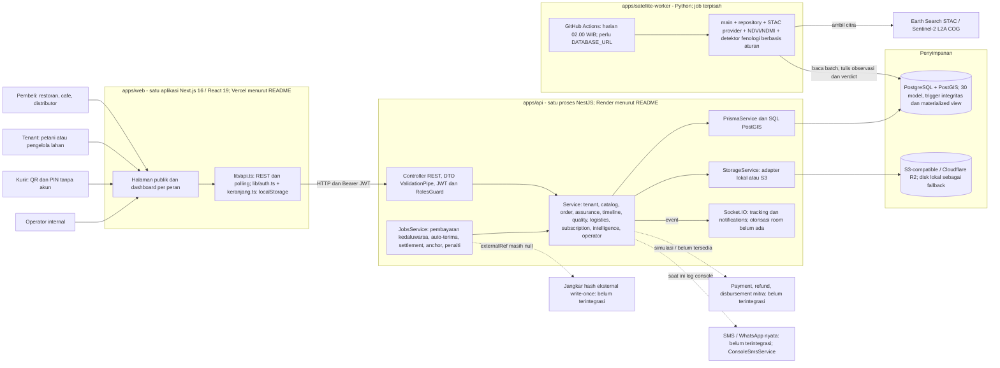
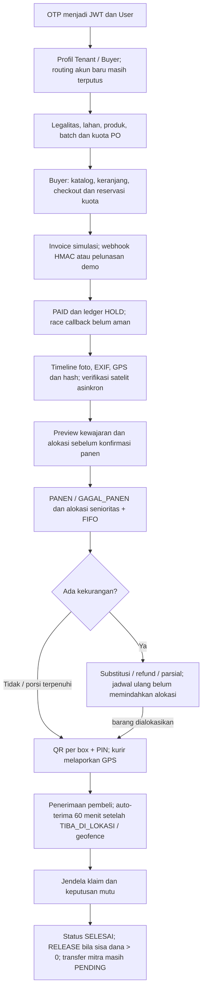

# Arsitektur AgroUs yang terimplementasi — audit 9–11 September 2026

Diagram mengikuti impor, pemanggilan jaringan, repository dan konfigurasi dalam kode. Nama hosting berasal dari README; konfigurasi akun cloud, kapasitas database, backup, dan secret produksi belum diperiksa langsung. API adalah **modular monolith**, bukan 15 microservice yang di-deploy sendiri-sendiri. Tidak ditemukan API gateway terpisah, message broker, Redis, atau sistem antrean persisten dalam implementasi runtime.

Garis putus-putus menunjukkan integrasi yang belum selesai. Server WebSocket ada, tetapi halaman pembeli yang diperiksa memakai REST polling; diagram sengaja tidak menggambar client WebSocket aktif. Worker langsung membaca/menulis database yang sama, sehingga perubahan status/baseline harus diselaraskan dengan API dan migration.

## Alur data utama

## Sumber dan keputusan penting

- `apps/api/src/app.module.ts` dan `src/modules/*/*.module.ts`: satu aplikasi dengan dependency injection antar-modul.
- `apps/api/src/main.ts`: raw body webhook, validasi global, CORS dan file serving. `health.controller.ts` hanya liveness, tidak menguji kesiapan database/storage.
- `apps/api/src/prisma/prisma.service.ts`: PrismaPg dengan koneksi lazy; keberhasilan `/health` tidak membuktikan query database berhasil.
- `apps/api/src/modules/storage/storage.module.ts`: konfigurasi S3 separuh lengkap menggagalkan startup; tidak ada kredensial sama sekali kembali ke disk lokal dengan warning.
- `apps/api/src/modules/jobs/jobs.service.ts`: cron dalam proses API dengan lock di memori; kebutuhan koordinasi antar-replika belum diselesaikan secara terpusat.
- `apps/api/src/modules/timeline/anchor.service.ts`: hash root disimpan internal; `externalRef` dan `publishedAt` null.
- `apps/web/src/lib/api.ts`: default origin menuju API demo Render bila environment frontend tidak diisi. Ini perlu diganti dengan konfigurasi eksplisit untuk menghindari dev menyentuh demo/produksi.
- `apps/satellite-worker/src/main.py`, `repository.py`, `stac_provider.py` serta `.github/workflows/satellite-verify.yml`: sumber Earth Search dan penjadwalan terpisah. Secret cloud aktual belum diverifikasi.

Rencana di `ARCHITECTURE_PLAN.md` masih berguna sebagai tujuan, tetapi menyebut Next.js 15, Mapbox, shadcn dan lapisan repository/domain backend yang belum sama dengan kode sekarang. Perbarui dokumen berdasarkan keputusan akhir; tidak perlu menambah microservice hanya agar terlihat lebih canggih.
